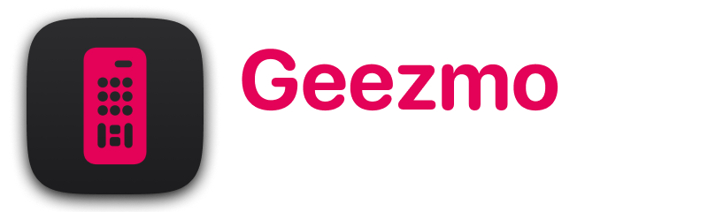

# Geezmo

Geezmo is a simple yet powerful remote control app for LG Smart TVs. Whether you need to control the volume, navigate channels, or turn the TV on and off, Geezmo provides an intuitive interface that makes it easy to manage your TV from your iPhone. It also comes with a companion app for watchOS, allowing you to control your TV directly from your Apple Watch.

## Features

- **Full TV Control**: Navigate your LG Smart TV, easily switch channels and ajust volume levels.
- **Power Control**: Turn your TV on or off directly from the app.
- **App Browser**: Browse apps installed on your LG Smart TV and easily launch them.
- **Apple Watch Companion App**: Control your TV from your wrist with the companion app for Apple Watch.
- **Light & Dark Mode**: Geezmo supports light and dark mode on iOS.
- **Multi-language Support**: Geezmo supports three languages—English, Russian, and Kazakh.

## Built with SwiftUI

Geezmo is built using SwiftUI, Apple's modern declarative framework for building user interfaces. This allows for a seamless and responsive experience across iOS and watchOS, providing a consistent and intuitive user interface.

## Installation

1. **Clone the Repository**: 
   ```bash
   git clone https://github.com/jareksedy/Geezmo.git
   ```

2. **Build and Run**: Open the project in Xcode, build it, and run on your iOS device. Don’t forget to install the watchOS companion app if you wish to control your TV from your Apple Watch.

3. **Enjoy**: Once installed, Geezmo is ready to use—no complicated setup required!

## Usage

Geezmo is designed to be intuitive and user-friendly. Simply open the app and start controlling your LG Smart TV with the buttons provided. No additional instructions are necessary—just tap and control!

## Contributing

We welcome contributions to Geezmo! Feel free to submit pull requests or open issues. While we don't have specific guidelines at the moment, we appreciate clean, well-documented code.

## License

Geezmo is licensed under the MIT License. See the [LICENSE](LICENSE) file for more information.

## Acknowledgments

Geezmo relies heavily on the [WebOSClient](https://github.com/jareksedy/WebOSClient) library, which is instrumental in enabling communication with LG Smart TVs.

